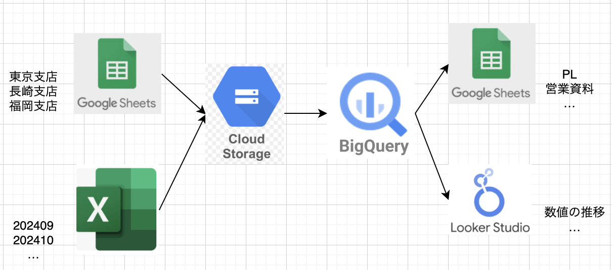

## 概要
Google DriveとスプレッドシートからデータをGCSに取り込み、BigQueryに連携し、Looker Studioやスプレッドシートで経営関連の資料を作成するためのパイプラインです｡

## 連携処理の概要



連携処理をClaud RunとClaudRun Jobで実装しており､Claud Workflowsでパイプラインを構成している｡
各jobにおけるエラーやアラートをGoogle Loggingに送っている｡

### パイプラインフロー

```
Cloud Workflows
    ├── Step 1: drive-to-gcs
    │    - 1-1: 整合性確認
    │      - 取り込み件数が0件のテーブルがあった場合、そのファイル名をアラート (to workflows)
    │      - 何らかの原因で取り込みエラーがあった場合、そのファイル名をアラート (to workflows)
    ├── Step 2: 待機 (2分)
    ├── Step 3: spreadsheet-to-bq
    │    - 3-1: 整合性確認
    │      - 取り込み件数が0件のシートがあった場合、そのシート名をアラート (to workflows + to logging)
    │      - 何らかの原因で取り込みエラーがあった場合、そのシート名をアラート (to workflows)
    ├── Step 4: 待機 (2分)
    ├── Step 5: gcs-to-bq
    │    - 5-1: 整合性確認
    │      - カラムの不整合が起きている場合に、起きているテーブルと不整合が起きているカラムをアラート (to workflows + to logging)
    │      - 何らかの原因でBigqueryへの取り込みエラーがあった場合、そのテーブル名をアラート (to workflows)
    ├── Step 6: 待機 (3分)
    ├── Step 7: dwh-datamart-update (Job実行・完了待ち)
    │    - corporate_data配下のテーブルをcorporate_data_bkにコピー (to logging)
    │    - コピーしたテーブルと今回取り込んだあとのcorporate_dataの件数を比較し、テーブルごとの件数をloggingに出力 (to logging)
    │    - 7-1: 整合性確認
    │      - main_category='その他'に値が入っている場合alert (to logging)
    │      - corporate_data配下各テーブルで定義されたユニークキーを用いて重複が発生していないか確認し、発生していたらアラート (to logging)
    └── Step 8: 完了通知 (y.tanaka@tanacho.com宛に) ※未実装
```

## 各処理概要

| ステップ | 該当job | 処理内容 | 備考 |
|---------|---------|--------|-------------|
| 1 | drive-to-gcs | driveからgcsのgoogle-drive/raw/yyyymmに連携する処理 |  |
| 2 | spreadsheet-to- | スプレッドシートからspreadsheet/raw/yyyymmに連携する処理 |  |
| 3 | gcs-to-bq |  | Pub/Sub: transform-trigger |
| 4 | DWH作成 | ✗ 手動 | update_dwh.sh |
| 5 | DataMart作成 | ✗ 手動 | update_datamart.sh |
| 6 | Looker Studio | - | 手動参照 |

## デプロイ方法

## jobの確認方法

下記処理を実行
```
(resource.type="workflows.googleapis.com/Workflow" AND resource.labels.workflow_id="data-pipeline")
  OR
  (resource.type="cloud_run_revision" AND resource.labels.service_name=("drive-to-gcs" OR "spreadsheet-to-bq" OR "gcs-to-bq"))
  OR
  (resource.type="cloud_run_job" AND resource.labels.job_name="dwh-datamart-update")
  timestamp>="2025-12-25T17:48:00Z"
  ```